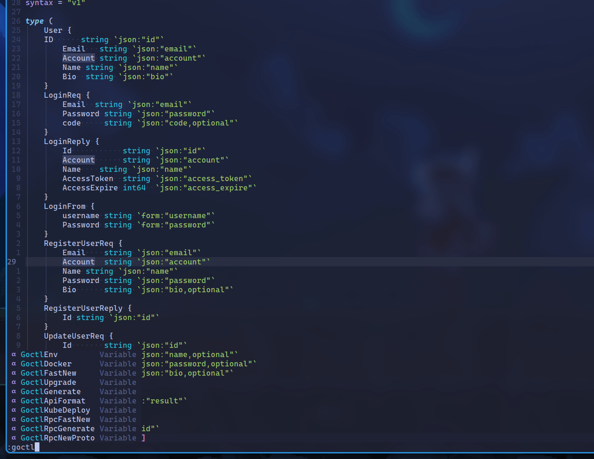

# Goctl plugin for Neovim

> goctl is a manager tool for micro framework go-zero

## Install

- packer.nvim

```lua
use({ "BYT0723/goctl.nvim", run = ":GoctlUpgrade" })
```

## Features

<details>
    <summary>Code Diagnostic</summary>
    
</details>

<details>
    <summary>Api Format</summary>
    
</details>

## Other

> plugin is being developed. We look forward to your participation and suggestions
