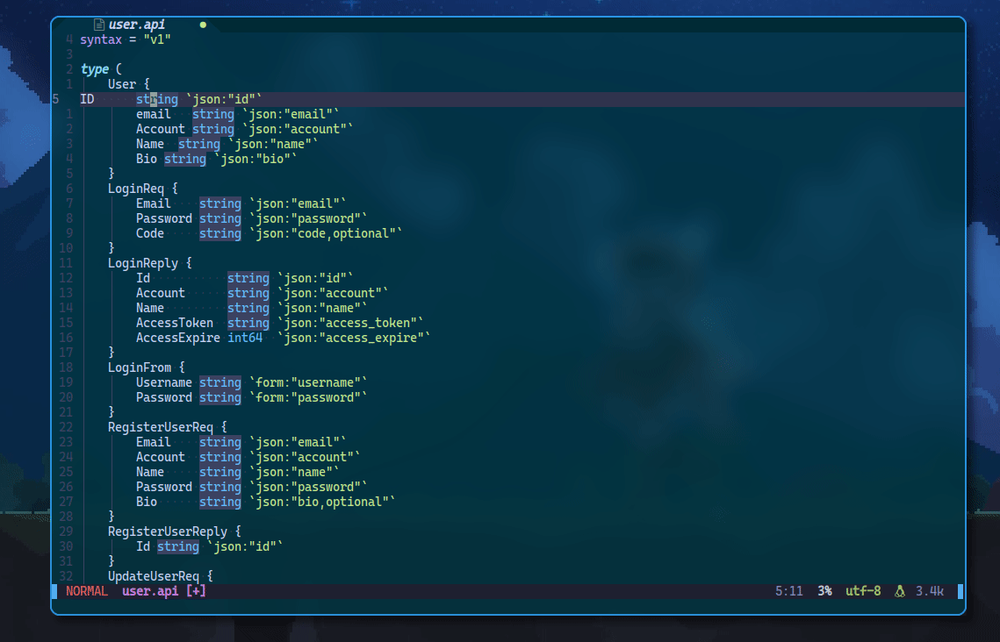
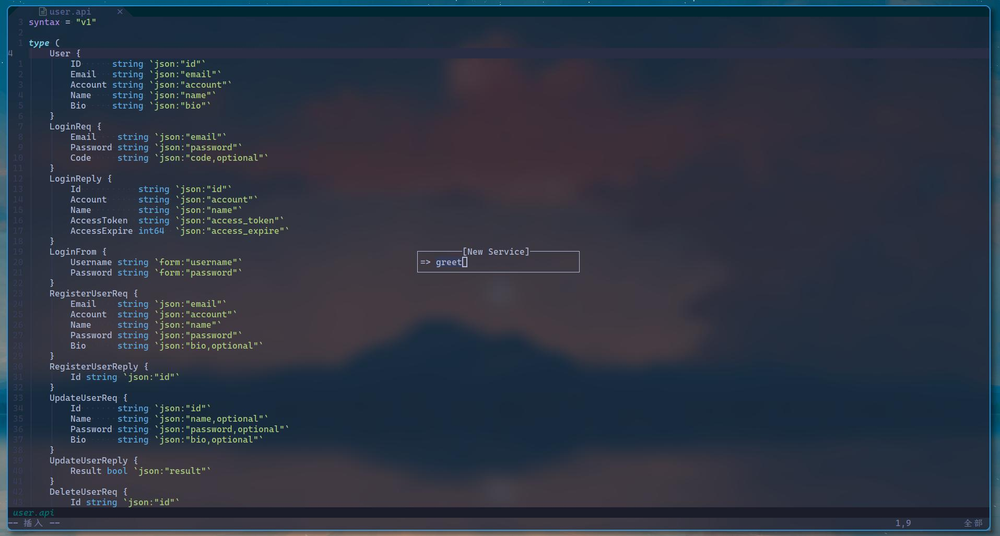

# Goctl plugin for Neovim

> goctl is a manager tool for micro framework go-zero

## Install

- packer.nvim

```lua
use({ "BYT0723/goctl.nvim", run = ":GoctlUpgrade", requires = {"MunifTanjim/nui.nvim"} })

-- recommend
use("rcarriga/nvim-notify")
```

## Init

```lua
require("goctl").setup()
```

## Features

- Validate

> goctl valid when vim event "BufRead", "TextChanged", "TextChangedI".

- Format

use command `GoctlApiFormat` or lua

```lua
-- format when write file
vim.api.nvim_command("au BufWritePre *.api lua require('goctl.api').format()")
```

- ApiMenu
use command `GoctlApi` or lua

```lua
require("goctl.api").menu()
```

## Preview

<details>
    <summary>Code Diagnostic</summary>
    
</details>

<details>
    <summary>Api Format</summary>
    
</details>

<details>
    <summary>Api</summary>
    
</details>

<details>
    <summary>ApiNew</summary>
    
</details>
<details>
    <summary>ApiGenerate</summary>
    
</details>

## Other

> plugin is being developed. We look forward to your participation and suggestions
